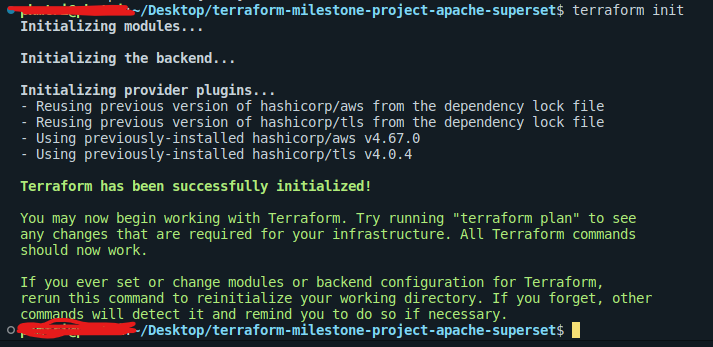
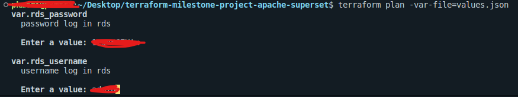
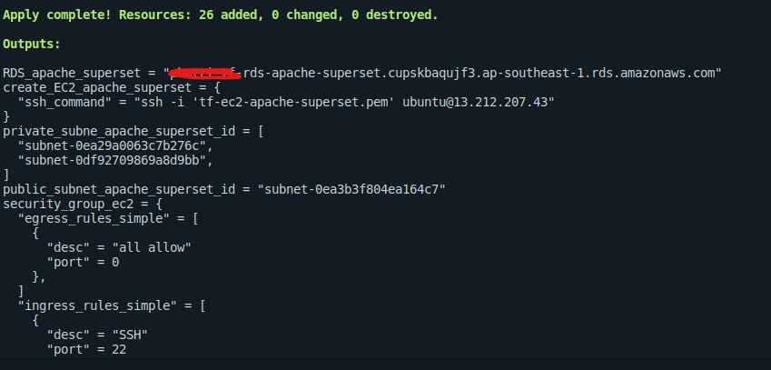
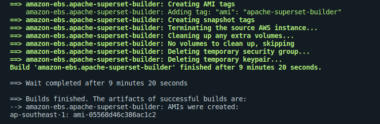
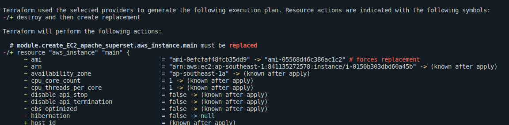
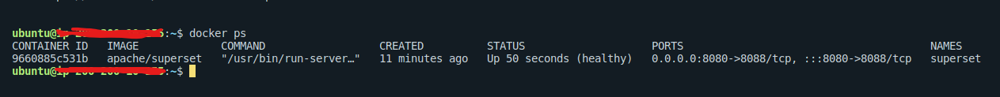
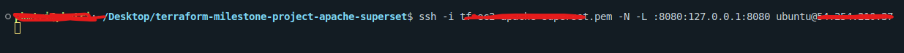
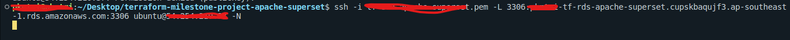
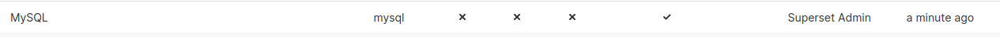
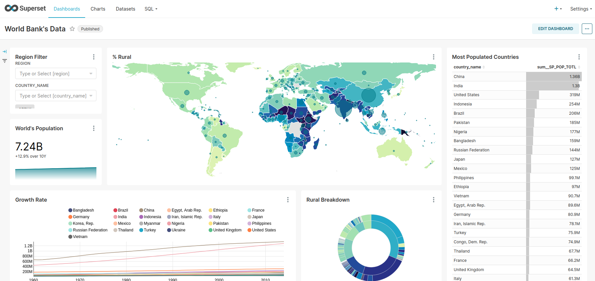

# terraform-milestone-project-apache-superset
Learn &amp; practice terraform aws throught out terraform milestone project

## Intro
Using terraform create the infrastructure on AWS

Using Packer create a new AMI EC2 have Apache Superset container

## Install
Terraform 0.1.25

Packer

## Demo
- 1.Create Infrastructures by Terraform

- 2.Create a new AMI have apache superset by Packer

Change the old AMI “ami-0efcfaf48fcb35dd9” to the new AMI “ami-0f947193a5dc92abf”

- 3.Terraform apply again to update the new infrastructure.

- 4.Access to Apache Superset and connect RDS MySQL to Apache Superset 

Using Port forwarding technical to login to Apache Superset, connect from rds to apache superset

## Login Apache Super and connect to RDS MySQL

